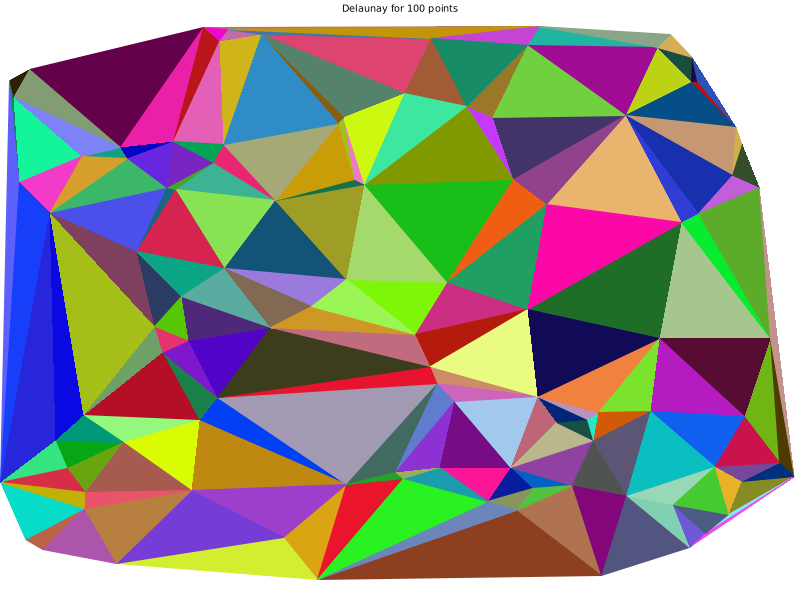
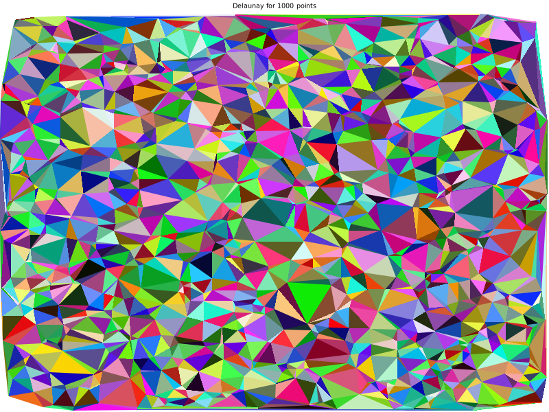
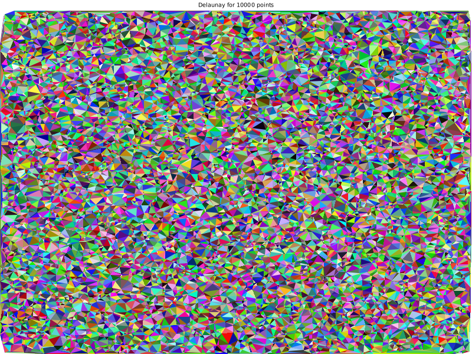
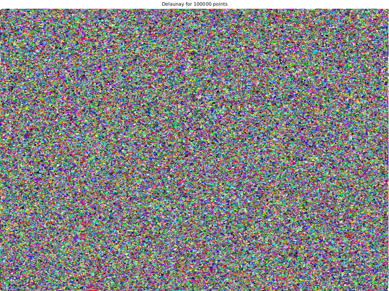

#### Examples to see in the CLI:
```
cargo run --example simple_2d_triangulation
```

#### How to visualize by specifying the number of points:
```
cargo run --example 2d_plot 100
```






#### or use this library on your project
Create sample-project
```
cargo new sample-project
cd sample-project
```

Edit Cargo.toml
```
delaunay_creator = "0.2.4"
```

Edit src/main.rs
```
fn main() {
    let square = vec![
        delaunay_creator::Point2D { x: 0.0, y: 0.0 },
        delaunay_creator::Point2D { x: 1.0, y: 0.0 },
        delaunay_creator::Point2D { x: 0.0, y: 1.0 },
        delaunay_creator::Point2D { x: 1.0, y: 1.0 },
    ];
    let res = delaunay_creator::bowyer_watson(square);
    println!("{:?}", res);
}
```

Run
```
cargo run
[Triangle { a: Point2D { x: 0.0, y: 0.0 }, b: Point2D { x: 1.0, y: 0.0 }, c: Point2D { x: 1.0, y: 1.0 } }, Triangle { a: Point2D { x: 0.0, y: 1.0 }, b: Point2D { x: 0.0, y: 0.0 }, c: Point2D { x: 1.0, y: 1.0 } }]
```